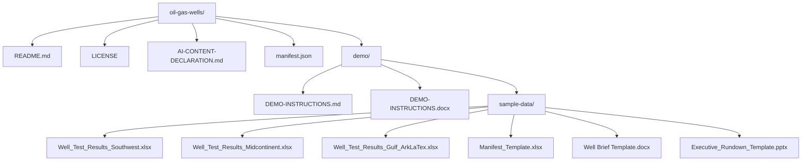

# MTT Demo Creation Tools

Public skill repository for MTT demo-building tooling used by Scout and Cowork.

## Install a release

Trainers can use either **Cowork or Scout**. Choose the product you prefer.
Install the complete package for your chosen product from
[GitHub Releases](https://github.com/rob-foulkrod/mtt-demo-creation-tools/releases).
Each ZIP includes demo-builder, demo-builder-generate-data with both approved CSVs, shared style guidance,
LICENSE, and INSTALL.md. Cowork additionally includes its references and an M365 plugin manifest.

- [Cowork plugin ZIP](https://github.com/rob-foulkrod/mtt-demo-creation-tools/releases/latest/download/cowork-plugin.zip)
- [Scout skills ZIP](https://github.com/rob-foulkrod/mtt-demo-creation-tools/releases/latest/download/scout-skills.zip)
- [Checksums](https://github.com/rob-foulkrod/mtt-demo-creation-tools/releases/latest/download/SHA256SUMS.txt)

**Cowork:** download the ZIP in your browser and install through **Customize > Plugins > Add plugin**
using the steps below. **Scout:** use the installation prompt below, or attach the downloaded Scout
ZIP and use that prompt. A download or temporary extraction is not a persistent installation.
See [personal installation](plugins/INSTALL.md) for requirements and the advanced Cowork fallback,
and [the deployment guide](docs/deployment.md) for release and acceptance-test details.

## Prompt: install everything for Scout

```text
Download and install this release for my personal use in Scout:
https://github.com/rob-foulkrod/mtt-demo-creation-tools/releases/latest/download/scout-skills.zip

Follow INSTALL.md. Install all three skill folders at the ZIP root: demo-builder,
demo-builder-generate-data (including companies.csv and names.csv), and demo-builder-style-guidelines.
Preserve all support files. Ask before replacing existing skills or local edits.
Use your configured personal skills location; do not fetch replacement files from main.
Report the release, installed names, versions, and locations, and verify both CSVs are readable.
Verify discovery in a new conversation if possible; otherwise mark it unverified.
If installation is blocked, explain the limitation rather than claiming success.
```

## Install in Cowork

1. Download the [Cowork plugin ZIP](https://github.com/rob-foulkrod/mtt-demo-creation-tools/releases/latest/download/cowork-plugin.zip)
    in your browser. Keep it zipped; do not use the Scout ZIP or GitHub's source-code archive.
2. Open **Cowork > Customize > Plugins > Add plugin**.
3. In **Add a plugin**, select **choose a file** and select the downloaded ZIP, or drag and drop
    the ZIP into the dialog. Follow the on-screen installation and consent steps.
4. Confirm **Demo Builder** appears in the installed plugins list.
5. Start a new Cowork conversation and paste the verification prompt below.

Cowork's chat workspace may not have download access. Attaching the ZIP to chat does not establish
plugin registration or persistence. Tenant policy must permit installation; see
[advanced personal installation guidance](plugins/INSTALL.md#advanced-personal-installation)
for personal sideloading and policy requirements. Do not delete existing skills before the replacement package
is available and validated; confirm any required removal and recovery plan before proceeding.

### Cowork verification prompt

```text
Verify my installed demo tools without downloading, installing, deleting, or replacing anything.
Check discovery of demo-builder, demo-builder-generate-data, and demo-builder-style-guidelines.
Read companies.csv and names.csv through the installed demo-builder-generate-data skill, and open the installed
demo builder's PRESENTER-GUIDE.md, QUALITY-STANDARDS.md, and TECHNOLOGY-GUIDANCE.md references.
Check that the shared style guidance is readable. Report the skill versions and host-provided
locations where available. Mark anything you cannot inspect as unverified; do not invent paths
or infer plugin registration from files attached to this conversation.
```

## Example Prompt

Use this prompt to create a GitHub-ready demo package with the Scout demo-builder skill and the
shared demo-builder-generate-data compliance skill:

```text
/demo-builder Using this skill and the demo-builder-generate-data skill I want to create a set of demos for an upcoming copilot class. I will give you a list of scenarios and will need the documents and demo instructions. Clearly label each demo. I am going to start with Agent Chaining. Agent Chaining is when I use Chat in Microsoft Copilot and attach the agents I need. For this demo I will simulate getting Three Excel files that I need to analyze and create a weekly Manifest File. The data is a series of test well results for the oils and gas industry. Use five states where a lot of test wells are dug around Texas where my customer is based. Include mineral data and other indicators common for this industry. My prompt should combine the results of all three files and show graphics. First I will have added the Analyst agent. Then I run the first prompt. When I get the results which should include graphics, I will then add the excel agent and reference a Manifest template file which you will also create and name Manifest_Template. And this prompt will ask copilot to create the new file from the data in the chat. The incoming files should have data we do not need for this manifest such as weather and land rights etc. and only have the analysis results so all up numbers by area and state with latitude and longitude and include a map visual. Once that is done, We will change to the word agent and using a word template called "Well Brief Template" that you will also create, we will create a new Well Brief based on the information from our chat so far. The Well brief should be highly stylized. Once we have that brief we will add the PPT agent and create a rundown based on a similarly styled PPTX that you will create a template for as well and we will add to the chat for context when we create the PPTX. Lastly we will prompt copilot for a brief email and agenda so we can send out the meeting invites. Use consistent style in all the templates for a modern corporate look that is not plain
```

Example output structure:




## Repository layout

| Path | Purpose |
| --- | --- |
| [`scout/demo-builder-SKILL.md`](https://github.com/rob-foulkrod/mtt-demo-creation-tools/blob/main/scout/demo-builder-SKILL.md) | Scout demo builder skill. It asks whether the package will be uploaded to GitHub, then creates either a GitHub-ready public demo repository package or a Cowork-compatible folder package. |
| [`scout/demo-builder-creator-maintenance-SKILL.md`](https://github.com/rob-foulkrod/mtt-demo-creation-tools/blob/main/scout/demo-builder-creator-maintenance-SKILL.md) | Creator-only support skill for maintaining the Scout demo builder, versions, change logs, repository updates, and local installed copies. |
| [`cowork/demo-builder-SKILL.md`](https://github.com/rob-foulkrod/mtt-demo-creation-tools/blob/main/cowork/demo-builder-SKILL.md) | Cowork demo builder runtime skill. It creates private-delivery, folder-native demo packages for OneDrive or SharePoint destinations and progressively loads companion references. |
| [`cowork/references/`](https://github.com/rob-foulkrod/mtt-demo-creation-tools/tree/main/cowork/references) | Cowork companion references for quality standards, presenter-guide specifications, and technology-specific guidance. |
| [`cowork/demo-builder-creator-maintenance-SKILL.md`](https://github.com/rob-foulkrod/mtt-demo-creation-tools/blob/main/cowork/demo-builder-creator-maintenance-SKILL.md) | Creator-only support skill for maintaining the Cowork demo builder, companion references, versions, change logs, and repository updates. |
| [`Common/demo-builder-edit-guardrails-SKILL.md`](https://github.com/rob-foulkrod/mtt-demo-creation-tools/blob/main/Common/demo-builder-edit-guardrails-SKILL.md) | Shared creator-only edit guardrails for keeping Scout and Cowork demo-builder behavior aligned during maintenance. |
| [`Common/demo-builder-style-guidelines-SKILL.md`](https://github.com/rob-foulkrod/mtt-demo-creation-tools/blob/main/Common/demo-builder-style-guidelines-SKILL.md) | Shared runtime style guidance for professional enterprise demo documents, workbooks, presentations, Pages, diagrams, and images. |
| [`Common/demo-builder-generate-data/SKILL.md`](https://github.com/rob-foulkrod/mtt-demo-creation-tools/blob/main/Common/demo-builder-generate-data/SKILL.md) | Shared demo-builder-generate-data compliance skill used before creating fictional companies, people, email addresses, or sample data. |
| [`Common/demo-builder-generate-data/companies.csv`](https://github.com/rob-foulkrod/mtt-demo-creation-tools/blob/main/Common/demo-builder-generate-data/companies.csv) | Approved fictitious company and domain list used by the demo-builder-generate-data skill. |
| [`Common/demo-builder-generate-data/names.csv`](https://github.com/rob-foulkrod/mtt-demo-creation-tools/blob/main/Common/demo-builder-generate-data/names.csv) | Approved person-name list used by the demo-builder-generate-data skill. |
| [`plugins/`](https://github.com/rob-foulkrod/mtt-demo-creation-tools/tree/main/plugins) | Prompt templates for generating self-contained Cowork plugin packages and Scout demo-builder skills without lifecycle-management features. |
| [`change logs/`](https://github.com/rob-foulkrod/mtt-demo-creation-tools/tree/main/change%20logs) | Versioned skill change logs documenting additions and deletions for every skill update. |

## How versioning works

A pushed `vMAJOR.MINOR.PATCH` tag builds and publishes
both ZIPs from that commit. The Cowork manifest uses the numeric version without `v` and keeps a
stable app ID. Each skill retains its independent `metadata.version`:

| Packaged skill | Current version | Source |
| --- | --- | --- |
| Scout demo builder | `2026.09.16.1` | [Scout runtime](scout/demo-builder-SKILL.md) |
| Cowork demo builder | `3.0.0` | [Cowork runtime](cowork/demo-builder-SKILL.md) |
| Shared style guidelines | `1.0.0` | [Style guidance](Common/demo-builder-style-guidelines-SKILL.md) |
| Demo builder generate data | `2026.09.16.1` | [Data skill](Common/demo-builder-generate-data/SKILL.md) |

Installed skills do not check main or update themselves. Install a newer complete release explicitly,
confirm replacements, and avoid duplicate skill registrations. Published release assets are not
overwritten. See [deployment.md](docs/deployment.md) for build commands and release rules.

## Demo Builder Generate Data dependency

Both demo builder skills depend on the shared demo-builder-generate-data skill whenever a package needs
fictional companies, people, email addresses, or sample data. Each release bundles SKILL.md,
companies.csv, and names.csv together. Preserve that folder. Demo-builder-generate-data owns validation and
reading of its own companion files; invoking demo builders should load demo-builder-generate-data and follow its
reported approved-name handoff, stop, or role-placeholder fallback behavior.

## Release tooling

- [Release workflow](.github/workflows/release.yml): PR/main candidate builds and tag publication.
- [Packager](scripts/release-packages.mjs) and [tests](scripts/release-packages.test.mjs): schema,
    folder/frontmatter, companion/link, archive, icon, and runtime-contract validation.
- [Version validator](scripts/validate-versions.mjs): current skill/change-log, Cowork manifest,
    workflow release version, and plugin skill-folder alignment.
- [Publisher](scripts/publish-release.mjs): draft uploads, asset verification, and latest selection.
- [Cowork manifest](plugins/cowork-manifest.json): stable app identity and developer metadata.
- [Installation guide](plugins/INSTALL.md), [privacy notice](docs/privacy.md), and
    [release strategy](docs/deployment.md).

## Updating skills

Creator-only maintenance instructions live in
[`scout/demo-builder-creator-maintenance-SKILL.md`](https://github.com/rob-foulkrod/mtt-demo-creation-tools/blob/main/scout/demo-builder-creator-maintenance-SKILL.md)
and
[`cowork/demo-builder-creator-maintenance-SKILL.md`](https://github.com/rob-foulkrod/mtt-demo-creation-tools/blob/main/cowork/demo-builder-creator-maintenance-SKILL.md)
so end-user demo package skills stay focused on runtime behavior. Creators should load
[`Common/demo-builder-edit-guardrails-SKILL.md`](https://github.com/rob-foulkrod/mtt-demo-creation-tools/blob/main/Common/demo-builder-edit-guardrails-SKILL.md)
before updating either demo builder, companion references, support skills, versions, change logs, or
local installed copies.
